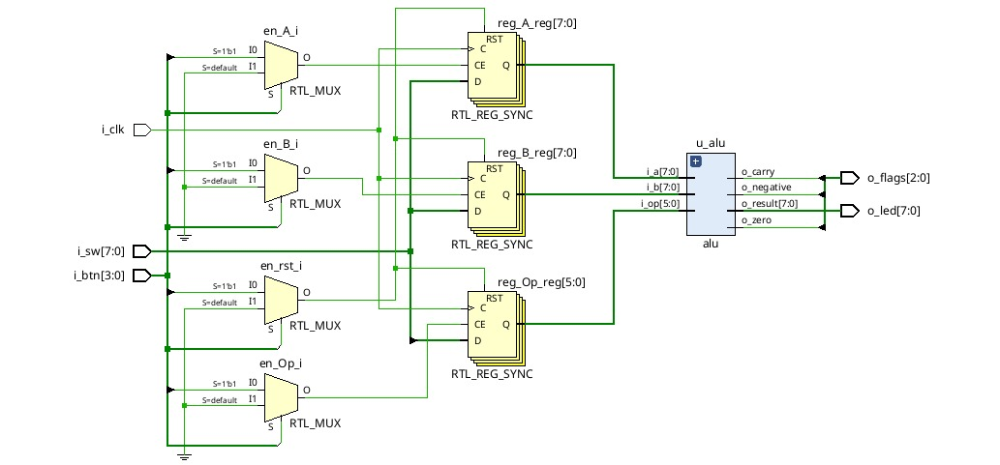
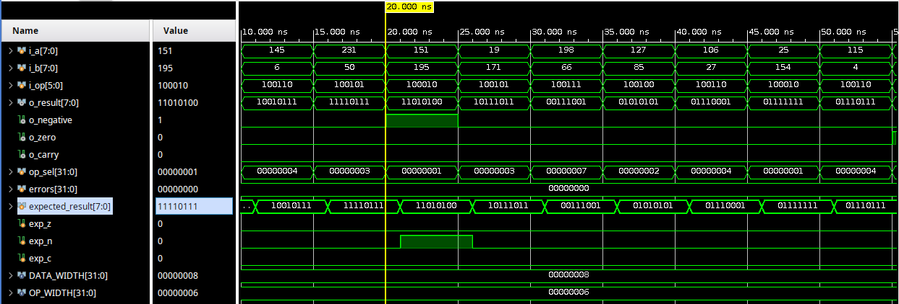
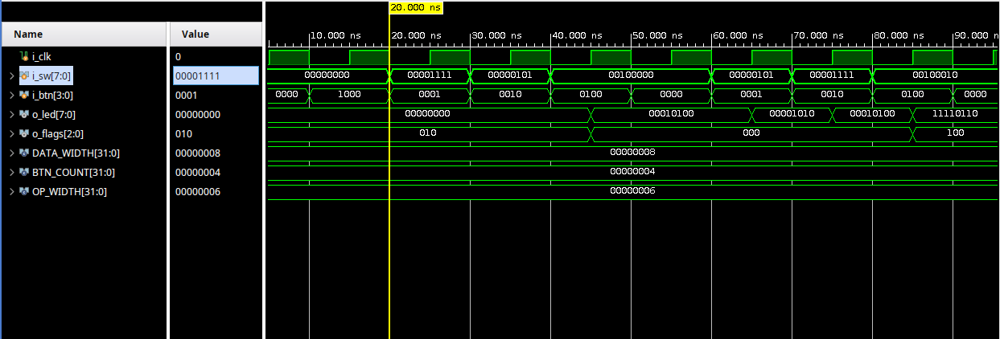

# Laboratorio Nº1:  Arithmetic logic Unit - ALU

---
## Objetivos

- Implementar una ALU parametrizable en FPGA.
- Validar el diseño mediante testbenches con entradas aleatorias y chequeo automático.
- Simular el comportamiento en Vivado y realizar análisis de tiempo.
- Integrar el diseño en la placa Basys 3 con interacción física.

---

## Arquitectura del Proyecto

| Módulo         | Descripción                                                                 |
|----------------|------------------------------------------------------------------------------|
| `alu.v`        | Núcleo de la ALU: operaciones aritméticas/lógicas y generación de flags.    |
| `alu_top.v`    | Interfaz con la placa: conexión con switches, botones y LEDs.               |
| `alu_top_tb.v` | Testbench funcional para simular el sistema completo.                       |
| `alu_tb.v`     | Testbench funcional para simular solo la ALU. 
| `alu_basys3.xdc` | Archivo de restricciones físicas para Basys 3.                            |

---

## Operaciones Soportadas

| Operación | Código   | Descripción               |
|-----------|----------|---------------------------|
| ADD       | `100000` | Suma                      |
| SUB       | `100010` | Resta                     |
| AND       | `100100` | AND lógica                |
| OR        | `100101` | OR lógica                 |
| XOR       | `100110` | XOR lógica                |
| SRA       | `000011` | Shift Right Arithmetic    |
| SRL       | `000010` | Shift Right Logical       |
| NOR       | `100111` | NOR lógica                |

---

## Interacción con la Placa

- **Switches (`i_sw`)**: entrada de datos y operación.
- **Botones (`i_btn`)**:
  - `BTNC`: carga A
  - `BTNU`: carga B
  - `BTNL`: carga operación
  - `BTNR`: reset
- **LEDs (`o_led`)**: muestran el resultado.
- **Flags (`o_flags`)**: indican `negative`, `zero`, `carry`.
  
---

## Validación y Simulación

- Testbench funcional (`alu_top_tb.v`)
- Testbench con entradas aleatorias y chequeo automático (`tb_alu.v`)
- Simulación en Vivado con capturas de resultados

 
 Figura 1. Esquematico RTL
 
 Figura2. [Esquematico Tecnologia](img/schematic.pdf)
 
 
 Figura 3. Simulación de la ALU: operaciones con actualización de banderas 

 
 Figura 4. Simulación del módulo superior alu_top: carga de operandos y ejecución de operaciones

---

## Parametrización

La ALU permite modificar:

- `DATA_WIDTH`: ancho del bus de datos (ej. 8 bits)
- `OP_WIDTH`: ancho del código de operación (6 bits)

Esto permite reutilizar la ALU en futuros proyectos con diferentes tamaños de datos.

---

##  Flags 

- `zero`: resultado igual a cero
- `negative`: bit más significativo en 1
- `carry`: acarreo en ADD 
---

##  Archivos de Restricción

- Clock: 100 MHz
- Switches: `SW7-SW0`
- Botones: `BTNC–BTNR`
- LEDs: `LD7-LD0` y `LD15–LD13` para flags

---

##  Conclusión

- Diseño funcional y parametrizable
- Validación completa por simulación
- Flags precisas y visuales
- Integración exitosa en Basys 3
- Listo para extender en el trabajo final

---

