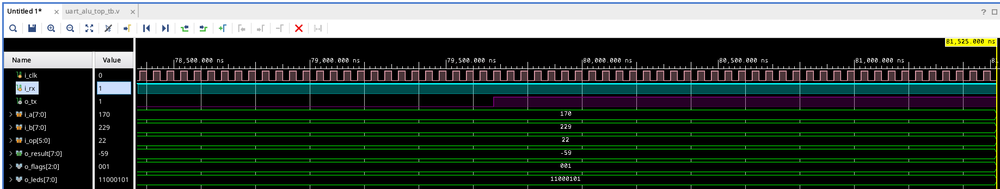
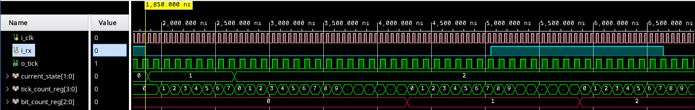
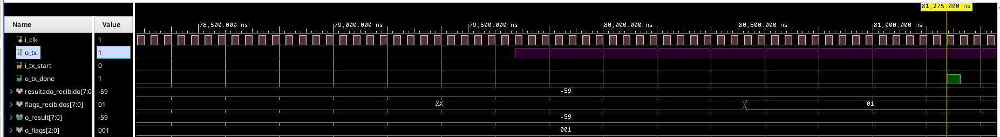
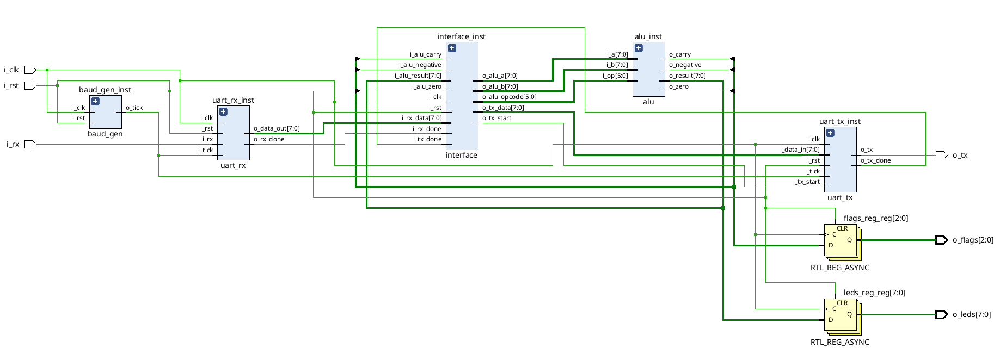

# Trabajo Práctico N°2: Comunicación UART con FSM y ALU

---

## Objetivos

- Implementar una comunicación serie UART entre una PC y la FPGA.
- Diseñar un receptor y un transmisor UART mediante máquinas de estados finitas (FSM).
- Utilizar oversampling x16 para sincronizar la recepción de los datos.
- Integrar la ALU desarrollada en el TP01 con el sistema de comunicación UART.
- Recibir operandos y código de operación desde la PC.
- Enviar hacia la PC el resultado de la operación y los flags generados por la ALU.
- Validar el funcionamiento completo mediante simulación en Vivado.

---

## Arquitectura del Proyecto

| Archivo | Descripción |
|---------|-------------|
| `alu.v` | ALU parametrizable reutilizada del TP01. Realiza operaciones aritméticas, lógicas y desplazamientos. |
| `baud_gen.v` | Generador de ticks utilizados para sincronizar UART RX y UART TX. |
| `uart_rx.v` | Receptor UART implementado mediante una FSM. Convierte la información serie recibida en bytes. |
| `uart_tx.v` | Transmisor UART implementado mediante una FSM. Convierte los bytes de salida en una transmisión serie. |
| `interface.v` | FSM de control que coordina UART RX, ALU y UART TX. |
| `uart_alu_top.v` | Módulo superior que integra todos los bloques del sistema. |
| `uart_alu_top_tb.v` | Testbench utilizado para verificar el funcionamiento completo del sistema. |
| `conexion_serie.py` | Programa ejecutado en la PC para enviar operaciones a la FPGA y recibir los resultados. |
| `uart_basys3.xdc` | Archivo de restricciones utilizado para conectar las señales del diseño con los pines físicos de la FPGA. |

---

## Diagrama General

El sistema implementado posee la siguiente estructura:

PC → UART RX → Interface → ALU → Interface → UART TX → PC

El módulo `uart_alu_top.v` realiza la integración de todos los bloques.

La PC envía tres bytes:

[A] [B] [OP]

donde:

- `A`: primer operando.
- `B`: segundo operando.
- `OP`: código de la operación.

Una vez realizada la operación, la FPGA devuelve dos bytes:

[RESULTADO] [FLAGS]

---

## Operaciones Soportadas

| Operación | Opcode | Descripción |
|-----------|--------|-------------|
| ADD | `100000` | Suma |
| SUB | `100010` | Resta |
| AND | `100100` | AND lógica |
| OR | `100101` | OR lógica |
| XOR | `100110` | XOR lógica |
| NOR | `100111` | NOR lógica |
| SRA | `000011` | Shift Right Arithmetic |
| SRL | `000010` | Shift Right Logical |

---

## Generador de Baud Rate

El módulo `baud_gen.v` genera los ticks utilizados por los módulos UART.

El sistema utiliza:

- Clock de FPGA: `100 MHz`
- Baud rate: `9600 baud`
- Oversampling: `16`

El divisor utilizado se calcula como:

COUNT_MAX = CLK_FREQ / (BAUD_RATE × OVERSAMPLING)

De esta manera se genera un tick a una frecuencia 16 veces superior al baud rate de la comunicación UART.

Los ticks no representan directamente un bit UART. Se utilizan como referencia temporal para que los módulos RX y TX puedan determinar cuánto tiempo debe durar cada bit.

---

## UART RX

El módulo `uart_rx.v` recibe la información serie proveniente de la PC.

La recepción utiliza una máquina de estados con cuatro estados:

- `S_IDLE`: espera el comienzo de una transmisión.
- `S_START`: detecta y valida el bit de START.
- `S_DATA`: recibe los ocho bits de datos.
- `S_STOP`: espera el bit de STOP y finaliza la recepción.

La línea UART se encuentra normalmente en estado lógico `1`.

Cuando se detecta un `0`, el receptor interpreta que puede haber comenzado un bit de START. Utilizando oversampling x16, se espera hasta aproximadamente el centro del START para verificar que la línea continúa en `0`.

Una vez validado el START, cada bit de datos se muestrea cada 16 ticks, manteniendo las muestras aproximadamente en el centro de cada bit.

UART transmite primero el bit menos significativo (`LSB`).

Cuando se reciben los ocho bits, el byte queda disponible en `o_data_out` y se genera la señal `o_rx_done`.

---

## UART TX

El módulo `uart_tx.v` realiza el proceso inverso al receptor.

Recibe un byte en paralelo y lo transmite de forma serie utilizando la siguiente trama:

START → D0 → D1 → D2 → D3 → D4 → D5 → D6 → D7 → STOP

La FSM del transmisor posee los estados:

- `S_IDLE`
- `S_START`
- `S_DATA`
- `S_STOP`

Cada bit permanece en la salida durante 16 ticks.

Cuando la transmisión del byte termina, se genera un pulso en `o_tx_done`.

---

## Interface UART - ALU

El módulo `interface.v` controla el funcionamiento general del sistema.

Su máquina de estados posee los siguientes estados:

- `S_GET_A`
- `S_GET_B`
- `S_GET_OP`
- `S_SEND_RESULT`
- `S_WAIT_RESULT`
- `S_SEND_FLAGS`
- `S_WAIT_FLAGS`

### Recepción de operandos

Inicialmente la FSM espera tres bytes provenientes de UART RX.

El primer byte se almacena como operando `A`.

El segundo byte se almacena como operando `B`.

El tercer byte contiene el opcode y se utilizan sus 6 bits menos significativos.

### Ejecución

La ALU es combinacional, por lo que no necesita una señal de START ni un estado específico de ejecución.

Cuando quedan almacenados `A`, `B` y `OP`, la salida de la ALU se actualiza a partir de dichos valores.

### Transmisión del resultado

Primero se transmite un byte con el resultado de la ALU.

La FSM espera que UART TX indique el final de la transmisión mediante `tx_done`.

A continuación se transmite un segundo byte que contiene los flags.

El formato del byte de flags es:

00000 C Z N

donde:

- `C`: Carry
- `Z`: Zero
- `N`: Negative

Una vez transmitidos ambos bytes, la FSM vuelve a `S_GET_A` y queda lista para recibir una nueva operación.

---

## ALU

La ALU utilizada corresponde al diseño desarrollado en el TP01.

Las entradas principales son:

- `i_a`
- `i_b`
- `i_op`

Las salidas son:

- `o_result`
- `o_carry`
- `o_zero`
- `o_negative`

La ALU es un circuito combinacional, por lo que el resultado depende directamente de los operandos y del opcode presentes en sus entradas.

Los flags utilizados son:

- `zero`: resultado igual a cero.
- `negative`: resultado negativo para las operaciones correspondientes.
- `carry`: acarreo generado por la suma.

---

## Módulo Superior

El módulo `uart_alu_top.v` integra:

- `baud_gen`
- `uart_rx`
- `uart_tx`
- `interface`
- `alu`

El generador de baud entrega el mismo tick a UART RX y UART TX.

UART RX entrega los bytes recibidos a la interface.

La interface almacena los operandos y el opcode y los entrega a la ALU.

El resultado y los flags de la ALU vuelven a la interface, que controla su transmisión mediante UART TX.

Además, el resultado de la ALU se muestra en los LEDs de la placa y los flags se muestran mediante tres salidas adicionales.

---

## Comunicación con la PC

Para realizar la comunicación con la FPGA se utiliza el programa `conexion_serie.py`.

El programa permite ingresar desde la terminal:

- Operando A.
- Operando B.
- Operación a realizar.

A partir del nombre de la operación, Python obtiene automáticamente el opcode correspondiente.

Luego envía:

[A] [B] [OP]

mediante el puerto serie.

Después espera dos bytes enviados por la FPGA:

[RESULTADO] [FLAGS]

El resultado recibido puede interpretarse como un número con signo utilizando complemento a 2.

Finalmente, el programa muestra por terminal:

- operandos en decimal, hexadecimal y binario;
- operación realizada;
- resultado;
- representación hexadecimal y binaria del resultado;
- flags activos.

---

## Simulación

Para validar el funcionamiento del sistema se realizó un testbench sobre el módulo completo `uart_alu_top`.

El testbench simula el comportamiento de una PC comunicándose con la FPGA.

En lugar de escribir directamente sobre las entradas internas de la ALU, se generan tramas UART sobre `i_rx`.

De esta manera se comprueba el recorrido completo:

`Testbench → UART RX → Interface → ALU → Interface → UART TX → Testbench`

Para acelerar la simulación se utilizan valores de frecuencia de clock y baud rate menores a los utilizados físicamente en la placa, manteniendo la relación necesaria para el oversampling x16.

Como caso de prueba se utilizaron:

A = 10101010 = 170

B = 11100101 = 229

OP = SUB

El resultado esperado es:

170 - 229 = -59

En complemento a 2 de 8 bits:

-59 = 11000101

El byte de flags esperado es:

00000001

correspondiente al flag `Negative` activo.

El testbench reconstruye los bytes enviados por `o_tx` y verifica automáticamente tanto el resultado como los flags.

### Capturas de simulación

#### Funcionamiento general del sistema

La siguiente simulación muestra el funcionamiento general del sistema una vez recibidos los operandos y el código de operación.  
En este caso se utilizan `A = 170` (`10101010`), `B = 229` (`11100101`) y la operación `SUB`.  
La ALU produce como resultado `-59`, cuya representación en complemento a 2 de 8 bits es `11000101`.  
Además, el byte de flags vale `001`, indicando que el flag `Negative` se encuentra activo.

#### Recepción UART

La siguiente simulación muestra el funcionamiento del receptor UART (`uart_rx`).
Cuando la línea `i_rx` pasa de `1` a `0`, el módulo detecta el posible inicio de una trama y cambia de `S_IDLE` a `S_START`.

A partir de los pulsos generados por `o_tick`, el receptor utiliza `tick_count_reg` para medir el tiempo dentro de cada bit y validar el bit de inicio. Luego pasa al estado `S_DATA`, donde `bit_count_reg` comienza a contar los bits recibidos del dato serie.

De esta forma, el receptor reconstruye el byte de entrada utilizando oversampling x16.

#### Transmisión del resultado

La siguiente simulación muestra la etapa final del sistema, correspondiente a la transmisión de la respuesta hacia la PC.

Para el caso de prueba `A = 170`, `B = 229` y operación `SUB`, la ALU produce `o_result = -59` y `o_flags = 001`.  
Luego, el transmisor UART envía esta información en dos bytes consecutivos: primero el resultado y luego los flags.

El testbench reconstruye ambos valores a partir de la línea serie `o_tx`, obteniendo `resultado_recibido = -59` y `flags_recibidos = 01`, verificando así que la respuesta transmitida por la FPGA es correcta.

---

## Síntesis del Diseño

### Esquemático RTL

El esquemático RTL generado por Vivado permite observar la estructura jerárquica
del sistema y la interconexión entre los módulos principales: `baud_gen`,
`uart_rx`, `uart_tx`, `interface` y `alu`.

*Esquemático RTL del sistema UART + ALU.*

### Esquemático de Tecnología

Luego de la síntesis, Vivado transforma la descripción RTL en recursos
disponibles dentro de la FPGA, como LUTs, registros y lógica de interconexión.

[Esquemático de tecnología obtenido luego de la síntesis.](docs/technology_schematic.pdf)

## Parametrización

Los diferentes módulos permiten modificar parámetros como:

- `DATA_WIDTH`: ancho de los operandos y del resultado.
- `OP_WIDTH`: ancho del código de operación.
- `DATA_BITS`: cantidad de bits transmitidos por UART.
- `OVERSAMPLING`: cantidad de muestras utilizadas por bit.
- `CLK_FREQ`: frecuencia del clock del sistema.
- `BAUD_RATE`: velocidad de la comunicación UART.

Esto permite adaptar el diseño a diferentes configuraciones sin modificar la estructura general del sistema.

---

## Archivos de Restricción

El archivo `uart_basys3.xdc` define la conexión entre las señales del módulo
`uart_alu_top` y los pines físicos de la placa Basys 3.

### Clock y Reset

| Señal | Pin | Descripción |
|-------|-----|-------------|
| `i_clk` | `W5` | Clock de 100 MHz |
| `i_rst` | `U18` | Reset mediante botón BTNC |

Para el clock se define un período de `10 ns`, correspondiente a una frecuencia
de `100 MHz`.

### UART

| Señal | Pin | Dirección |
|-------|-----|-----------|
| `i_rx` | `B18` | PC → FPGA |
| `o_tx` | `A18` | FPGA → PC |

Estas señales permiten utilizar la interfaz USB-UART integrada en la Basys 3
para realizar la comunicación serie con la PC.

### LEDs de resultado

El resultado de 8 bits generado por la ALU se conecta a ocho LEDs de la placa
mediante `o_leds[7:0]`.

### Flags

Los flags se muestran mediante tres salidas:

- `o_flags[0]`: Negative
- `o_flags[1]`: Zero
- `o_flags[2]`: Carry

Todas las señales utilizan el estándar eléctrico `LVCMOS33`.

---

## Conclusión

En este trabajo práctico se implementó un sistema completo de comunicación UART integrado con la ALU desarrollada en el TP01.

El diseño permite recibir desde una PC dos operandos y un código de operación, ejecutar la operación correspondiente en la FPGA y transmitir nuevamente el resultado y sus flags.

La utilización de máquinas de estados permite controlar tanto la recepción y transmisión UART como la secuencia general de comunicación con la ALU.

Finalmente, el funcionamiento completo fue verificado mediante simulación, comprobando la recepción de los datos, el procesamiento en la ALU y la transmisión correcta del resultado.